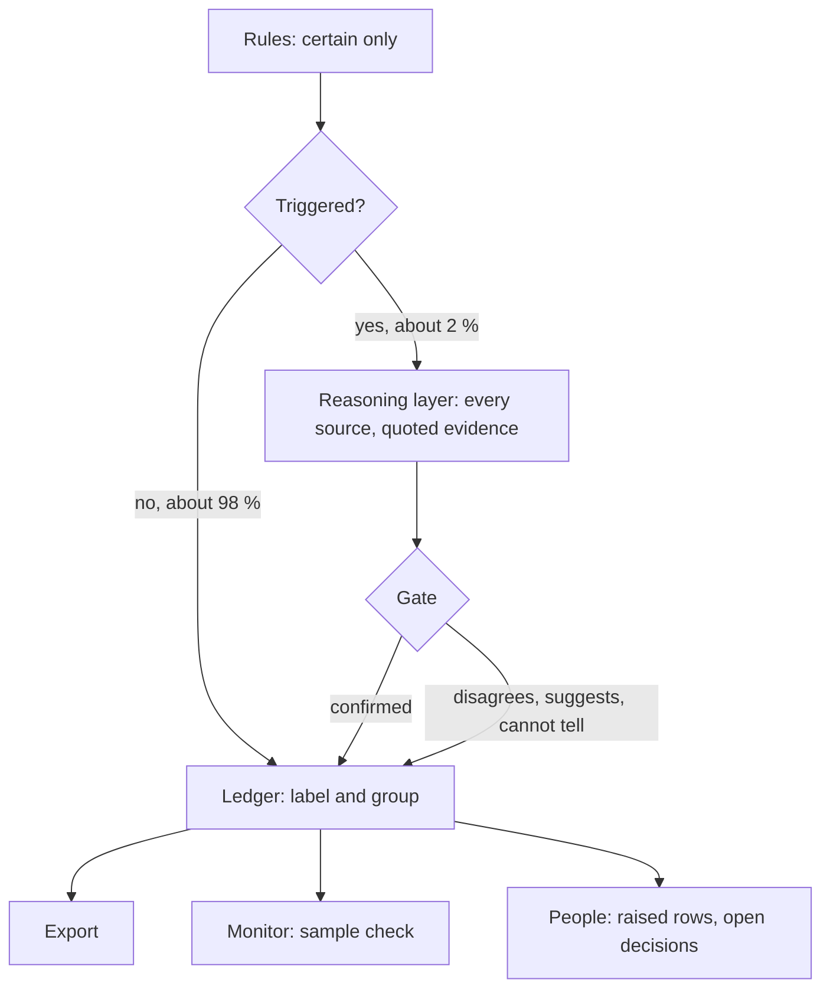

# Architecture: rules for certainty, AI for meaning, people for decisions

25 September 2026 · UoM data cleansing

## Why this changes

The sample check (a stronger model judging a fixed random sample per group) found the tool's
remaining mistakes were all text-pattern rules deciding what a number *means*: "3.3G" in a
yoghurt's name read as a size, "8 pieces" inside a jar read as a pack, "1.8 LT" of a cooker
converted as contents. Adding a rule per pattern does not scale: a 60,000-row workbook will
carry patterns this 13,000-row sample never showed, and there are no labelled answers to learn
from. So the rules stop deciding meaning. They decide only what is certain, and hand anything
that needs understanding to the reasoning layer, behind a deterministic gate.

## The layers

| Layer | Does | Examples | Scales because |
|---|---|---|---|
| Rules | certain arithmetic and form only | 1 KG = 1000 GM, rounding, equality, 1 % tolerance, "is a number" | arithmetic does not change with the data |
| Triggers | text patterns that flag "a number here might matter"; they no longer decide | a different size in the description, a count beside the pack, case wording, an old size in another unit | a false trigger costs one AI call, not a wrong answer |
| Reasoning layer | reads every source of a triggered row, says what each number means, quotes its evidence | capacity or contents, pieces inside or packs sold, a nutrient figure or a size | the model already knows products; the business rules are sentences |
| Gate | deterministic: decides what the AI's answer may do | only with a verified quote, high confidence, no open business rule, a standard unit, no unexplained total change | same rule every time |
| People | open business decisions and what the gate raised | the split question, coupon counts | only the remainder reaches them |
| Monitor | the sample check on every workbook | a stronger, different model judges a fixed random sample per group | new patterns show up as wrong verdicts, without reading rows |

## The gate

The AI never writes a new K/L/M value in this phase.

| Outcome | When | Effect in gate mode |
|---|---|---|
| CONFIRMED | the AI stands behind the value the row holds, confidently, with quoted words and no open business rule (product-kind knowledge is allowed and recorded) | the rules' raise is cleared; a note records the second reading; the cleared findings stay on the row for audit |
| DISAGREES | a confident, quoted, different answer | the row is raised, with the AI's values as the suggestion |
| AGREES_WITH_SUGGESTION | the AI supports the rules' own suggestion | stays raised; a note says so |
| SUGGESTS | a different answer without full confidence | offered as the suggestion, only on a row that is already raised |
| CANNOT_TELL | nothing settles it | unchanged; the explanation is shown to the reviewer |
| UNAVAILABLE | the call failed | unchanged; the run continues |

## Modes

`REASONER_MODE` in `.env`: `off` (default), `shadow` (the decision is recorded on each row and
changes nothing), `gate` (the gate acts). `REASONER_MODEL` picks the model (defaults to
`GEMINI_MODEL`); `REASONER_MAX_ROWS` caps the calls per run (3,000).

## One rulebook

The reasoning prompt (`uom_reconcile_v3.md`) and the judge prompt (`uom_judge_v4.md`) state the
same business rules as sentences: D1 (one piece), the open split question, loose counts on
coupons, the ounce reading, contents counts, and "a capacity, a nutrient amount, a grade is
never a size". A decision from the business changes one sentence in both, not code.

## Volume and cost

On the v0.2 workbook (run `f7c42eea`) 260 of 13,300 rows are triggered (2 %): 256 raised rows
and 4 notes. A 60,000-row workbook would be about 1,200 reasoning calls, plus the sample check
(160 to 300 judge calls).

## Rollout

1. Shadow on the next run: record the decisions, change nothing.
2. Compare: how many raises would be cleared, how many kept rows would be raised; the sample
   check on the same run in gate mode.
3. Gate mode once the comparison holds.
4. Turn the remaining meaning rules into pure triggers (they already raise only; the gate now
   answers them).

## Needed for 60,000 rows (not AI)

- Database size: a 13,000-row run is about 24 MB; Atlas free tier is 512 MB (it filled on
  25 September). A 60,000-row run is about 110 MB: a paid cluster or automatic pruning of old
  runs.
- Resumable processing: a long run continues from where it stopped.
- Concurrency and cost tracking for the reasoning and judge calls.

## Built on 25 September

`reasoning_stage.py` (triggers, gate, bounded parallel runner, failures isolated, budget cap),
`reasoning_codes.py`, the ledger's gate handling (`result-ledger-v8`), the processor stage
`REASONING` with its statistics, `uom_reconcile_v3.md`, settings `REASONER_MODE`,
`REASONER_MODEL`, `REASONER_MAX_ROWS`. Tests cover every outcome, shadow against gate, a failed
call, the cap and a full processing run.
