# Pipeline sequence

Every call, database write and AI call the tool makes, from upload to download. The diagrams
follow the code as it is on 24 September 2026. The same file is shown on the **Sequence** tab.

**Who takes part**

| Name in the diagrams | What it is |
|---|---|
| User | the person in the browser |
| Frontend | the React app |
| API | the FastAPI server (`backend/app/api`) |
| Worker | a background task in the API process: `JobProcessor`, `ExportService` or a report builder |
| Files | the file store on the server (`data/uom-jobs/<job>/input.xlsx`, `output.xlsx`) |
| MongoDB | the results database (MongoDB Atlas) |
| Gemini | the AI model, called through Google ADK |

**Numbers from the v0.2 workbook (job 9ea8ad60)**: 66,082 rows in the file, 13,300 in the two
departments, 758 purged, 12,542 live. 71 AI calls (55 description reads, 16 pack-count reads),
about 197,000 input and 21,000 output tokens. 13,300 result rows written.

## 1. High level

The whole journey in one picture. The sections below open each step.

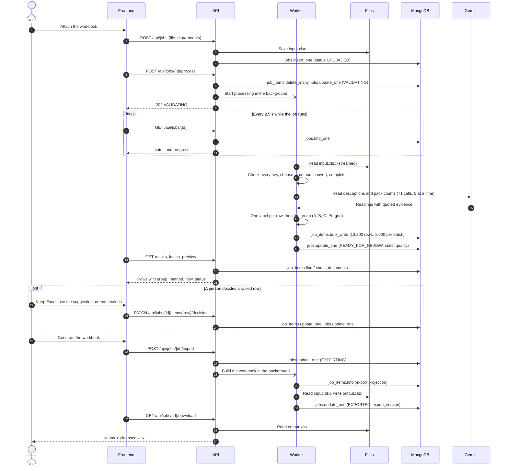

## 2. Server start

Runs once when the API starts.

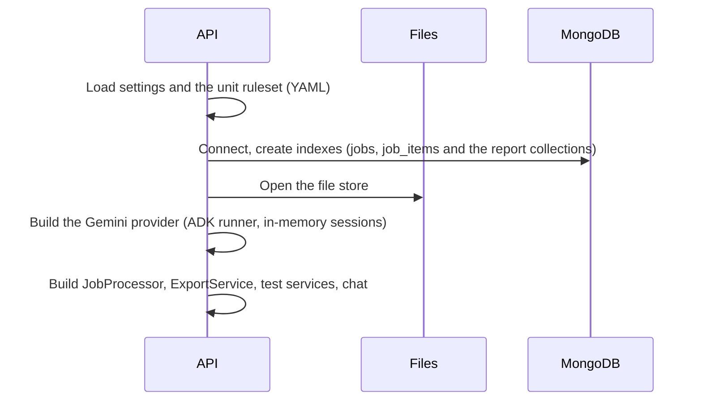

## 3. Upload

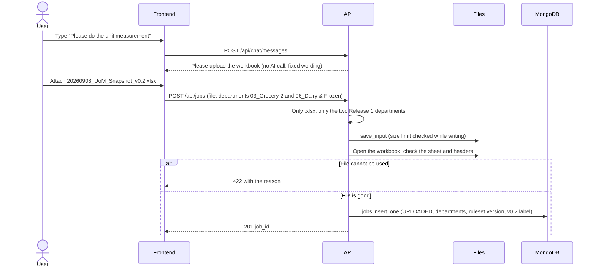

## 4. Start processing

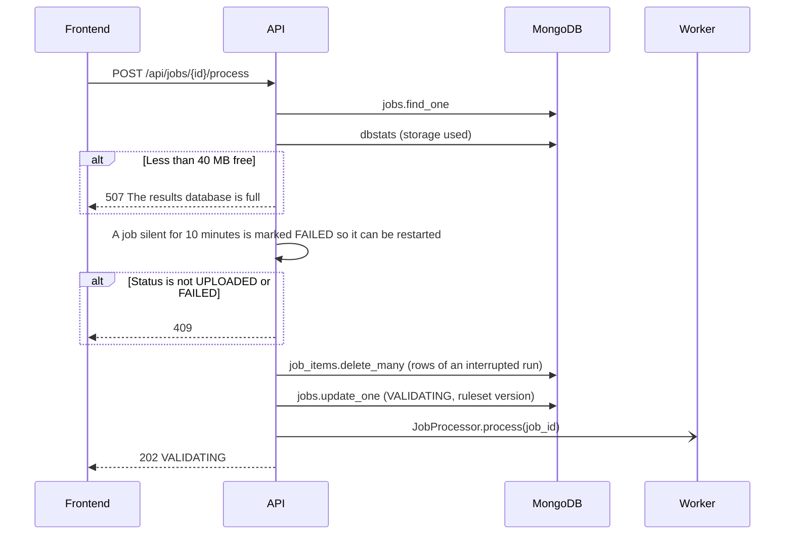

## 5. Processing

The worker runs inside the API process. Progress is written to the job at most every 0.75 s,
which is what the chat's progress bar shows. Nothing is written to `job_items` until every row
is finished.

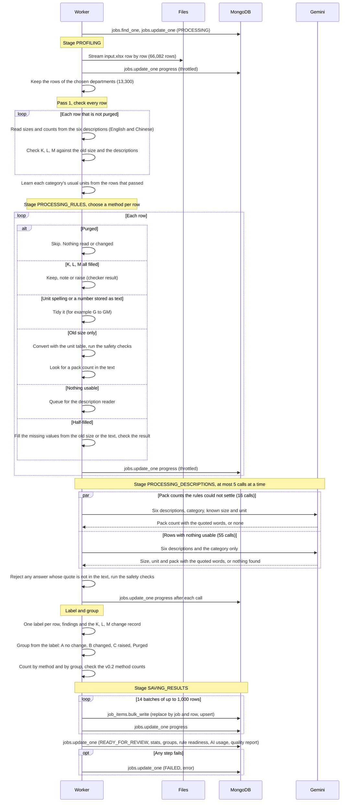

### One AI call in detail

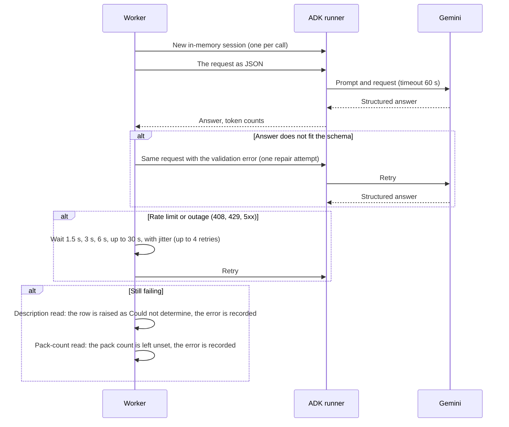

## 6. Reading results

Every tab reads. None of these calls change a row.

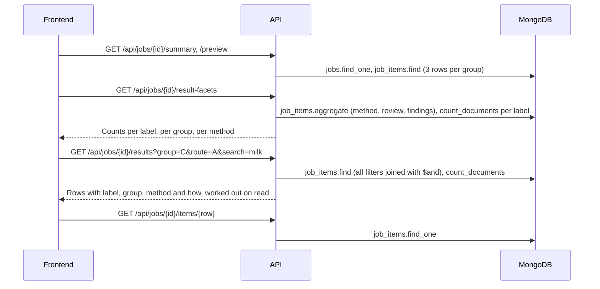

## 7. A person decides a raised row

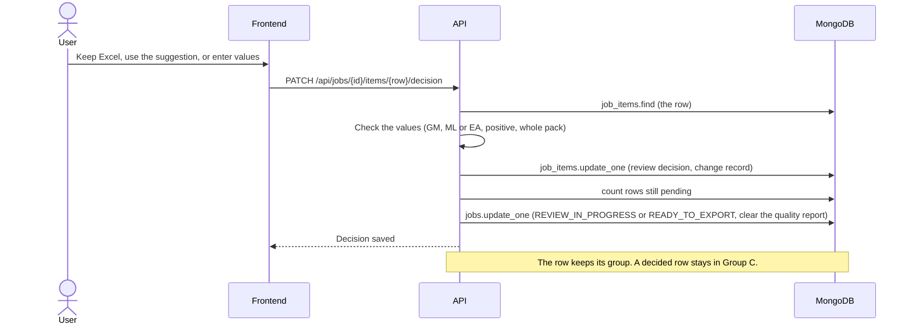

## 8. Export and download

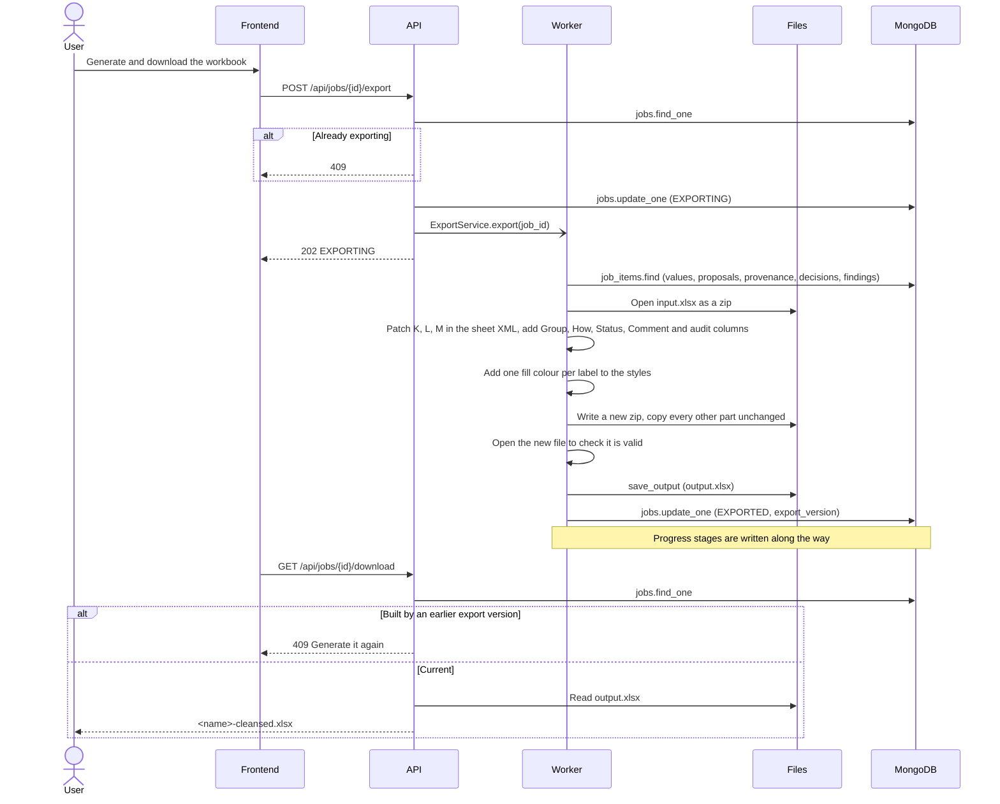

## 9. Reports built on demand

These tabs build their figures in the background the first time they are opened, keep them in
the database, and rebuild when the job or the report's version changes. The page shows the last
figures while a rebuild runs.

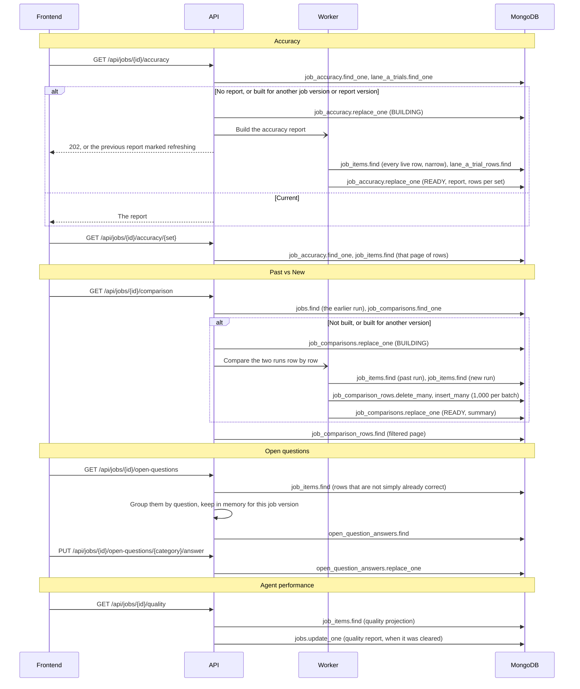

## 10. Tests and trials

Started by a person, never by the pipeline. The ones that call Gemini are paid.

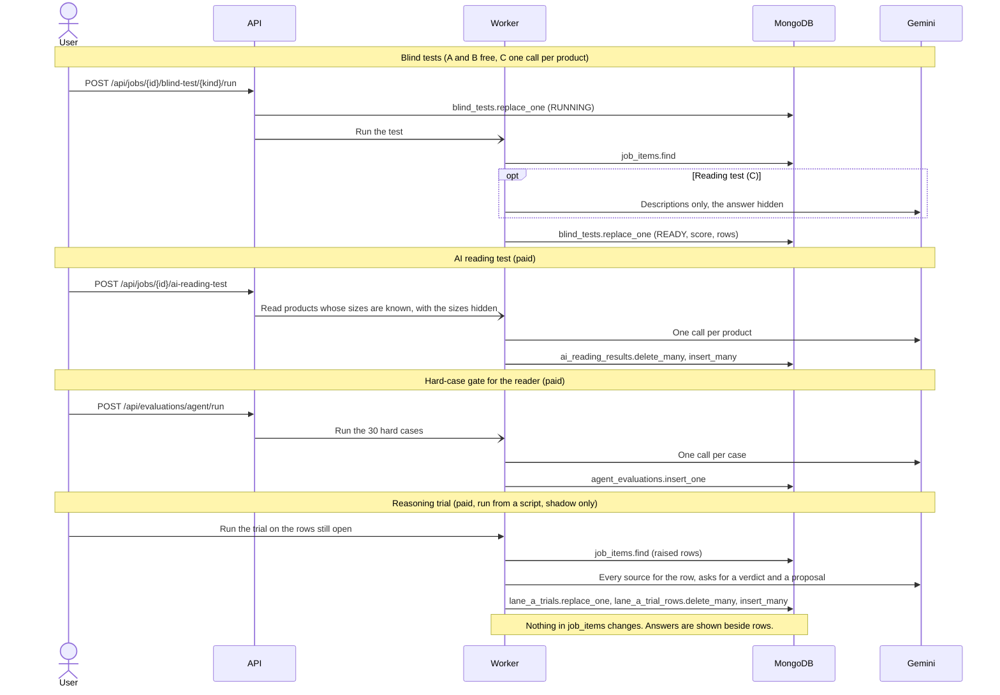

## 11. Job status

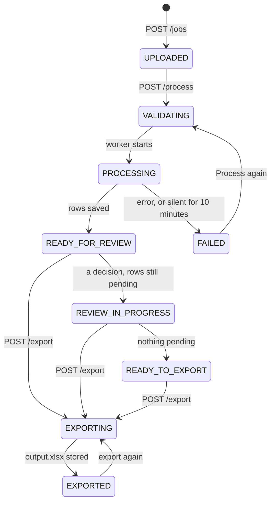

## 12. Every database write

| Collection | Operation | When | By |
|---|---|---|---|
| `jobs` | `insert_one` | upload | API |
| `jobs` | `update_one` | start, every progress step (at most every 0.75 s), finish, failure | API, Worker |
| `jobs` | `update_one` | each review decision (status, quality cleared) | API |
| `jobs` | `update_one` | export start, each export stage, export done | API, Worker |
| `jobs` | `update_one` | quality report rebuilt after decisions or sample verifications | API |
| `job_items` | `delete_many` | before a run starts (rows of an interrupted run) | API |
| `job_items` | `bulk_write` of `ReplaceOne` with upsert | end of a run, 1,000 rows per batch | Worker |
| `job_items` | `update_one` | a review decision or a sample verification | API |
| `job_items` | `update_many` | approving a whole conversion rule | API |
| `job_accuracy` | `replace_one` | accuracy build start and finish | API, Worker |
| `job_comparisons` | `replace_one` | comparison build start and finish | API, Worker |
| `job_comparison_rows` | `delete_many`, `insert_many` | comparison build | Worker |
| `open_question_answers` | `replace_one` | an answer to an open question | API |
| `blind_tests` | `replace_one` | blind test start and finish | API, Worker |
| `ai_reading_results` | `delete_many`, `insert_many` | AI reading test | Worker |
| `agent_evaluations` | `insert_one` | hard-case gate run | Worker |
| `lane_a_trials`, `lane_a_trial_rows` | `replace_one`, `delete_many`, `insert_many` | reasoning trial | script |

The files are written in two places only: `input.xlsx` at upload and `output.xlsx` at export.

## 13. Every AI call

| Call | Sees | Returns | When | Count on v0.2 |
|---|---|---|---|---|
| Description reader | six descriptions, category as context | size, unit, pack, quoted words | rows with nothing usable | 55 |
| Pack-count reader | six descriptions, category, known size and unit | pack count, quoted words | converted rows whose pack count the rules could not settle | 16 |
| Reading test | six descriptions, answer hidden | same as the reader | a person starts it | one per product tested |
| Hard-case gate | 30 fixed cases | same as the reader | a person starts it | 30 |
| Reasoning trial | every source for the row | verdict, proposal, explanation | a person runs the script | one per open row |

All calls go through the same provider: one ADK session per call, 60 s timeout, one repair
attempt for an answer that does not fit the schema, up to four retries with backoff for rate
limits and outages, at most five calls at a time. An answer is used only if the words it quotes
are really in the product's text.
